# 网络爬虫实战：爬取B站视频评论数据+分析
- [前言](#前言)
- [本文要点](#本文要点)
- [环境及工具](#环境及工具)
- [学习路径](#学习路径)
- [代码运行](#代码运行)
    - [控制台程序](#控制台程序)
    - [GUI程序](#gui程序)
- [爬取网页部分](#爬取网页部分)    
    - [分析目标网页](#分析目标网页)
    - [代码实现(初期)](#代码实现初期)
    - [线程类：`class SpiderThread(QThread)`](#线程类class-spiderthreadqthread)
- [数据分析](#数据分析)
    - [相关函数实现](#相关函数实现)
- [GUI界面](#gui界面)
    - [链接两个模块](#链接两个模块)
    - [窗口类class CrawIWindow(QWidget)](#窗口类class-crawiwindowqwidget)
- [python打包为.exe文件](#python打包为exe文件)
    - [使用pyinsatller工具命令打包](#使用pyinsatller工具命令打包)
- [思考与总结](#思考与总结)
- [参考资料](#参考资料)

## 前言
学校的小学期任务，需要做一个简单的小程序。  
我又一直对爬虫和数据分析相关的东西有兴趣，就选择做一个简单的爬虫工具。  
再加上个人经常上B站，所以就选择爬取B站的视频用户评论并对爬取的内容进行简单的分析。  
__其中内容很多都比较基础__，但因为自己在之前学习时，一直找不到详细的参考博客资料，走了许多弯路，所以想写一篇面向小白的博客

---
## 本文要点   
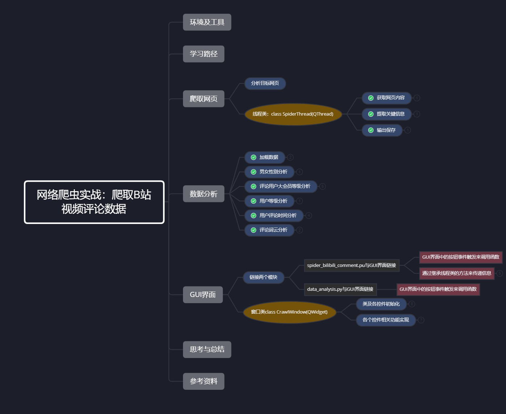

---
## 环境及工具
- 软件环境：win10
- 开发工具：
  - python3.7 + 相关库
  - PyCharm (写代码及测试)
  - VsCode (写markdown)
  - git + github （版本管理）
  - google + 百度

---

## 学习路径
- python语言基础：[python语言程序设计](http://www.icourse163.org/course/BIT-268001) 一周
- 爬虫基础：[python网络爬虫与信息提取](http://www.icourse163.org/course/BIT-1001870001) 一周
- 数据分析基础：[python数据分析与展示](http://www.icourse163.org/course/BIT-1001870002) 一周
- 将以上知识串联：[用python玩转数据](http://www.icourse163.org/course/NJU-1001571005) 三天
- 正式写代码 一周半（摸鱼3天）
- 实验报告书 两天
- 写代码时参考博客（部分）  
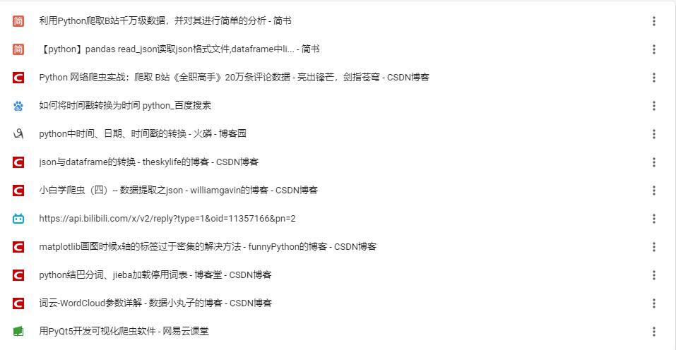

---
## 代码运行
### 控制台程序
- 配置好相关环境后，进入到控制台源代码目录下
- 输入命令 python main.py 后根据提示输入链接  
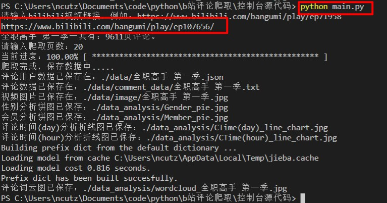
- 运行效果图同GUI界面程序，详情请看GUI说明书
- tips：因为这个代码实现比较早，正则表达式实现有点bug，所以只能爬取电影，电视剧，番剧等。
### GUI程序
- python GUI.py
- [GUI说明书](./GUI说明书.pdf)


---
## 爬取网页部分


### 分析目标网页
 [此部分搬运原博客](https://blog.csdn.net/wenxuhonghe/article/details/83791412)  
- 首先观察评论区结构，发现评论区为鼠标点击翻页形式，共 9399 页，每一页有 20 条评论，每条评论中包含 用户名、评论内容、评论楼层、时间日期、点赞数等信息展示。
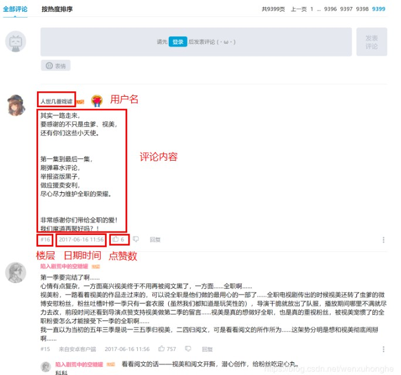
- 接着我们按 F12 召唤出开发者工具，切换到Network。然后用鼠标点击评论翻页，观察这个过程有什么变化，并以此来制定我们的爬取策略。
- 我们不难发现，整个过程中 URL 不变，说明评论区翻页不是通过 URL 控制。而在每翻一页的时候，网页会向服务器发出这样的请求（请看 Request URL）。
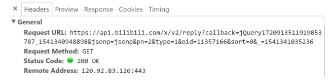  
Get API: https://api.bilibili.com/x/v2/reply?type=1&pn=xxx&oid=xxx    
pn是当前页数，oid是视频编号 
- 点击 Preview 栏，可以切换到预览页面，也就是说，可以看到这个请求返回的结果是什么。下面是该请求返回的 json 文件，包含了在 replies 里包含了本页的评论数据。  
这部分包含的信息特别多，我们到时候先将其抓取下来，然后从其中挑选出需要的信息就可以。  
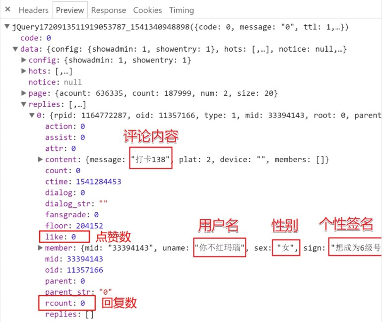

### 代码实现(初期)
- tips:这个代码是初期完成的，后期又在其基础上进行了许多修改，但大体的思路没有问题。  
[__完整代码__](./控制台源代码/spider_bilibili_comment.py)
- 获取页面信息函数
	```python
	def get_html_text(url, headers, code='utf-8'):
		'''
		通过指定url链接获取html页面，编码方法默认为utf-8。有简单的错误处理，但不会提示。

		:param url: 指定url
		:param headers:头
		:param code: 默认为'utf-8'
		:return: 返回相应的html页面信息
		'''
		try:
			r = requests.get(url, headers=headers, timeout=30)
			r.raise_for_status()
			r.encoding = code
			return r.text
		except:
			traceback.print_exc()
			print("获取html页面失败")
			return ""
	```

- 获取视频相关信息：oid号，Name，评论区总页数等等
	```python
	def main():
		url = 'https://www.bilibili.com/bangumi/play/ss12717/'          # 扫毒
		headers = {
			'accept': 'text/html,application/xhtml+xml,application/xml;q=0.9,image/webp,image/apng,*/*;q=0.8',
			'user-agent': 'Mozilla/5.0 (Windows NT 10.0; WOW64) AppleWebKit/537.36 (KHTML, like Gecko) '
						'Chrome/68.0.3440.106 Safari/537.36',
		}
		start_html = get_html_text(url, headers)
		try:
			# 得到视频AV(oid)号
			oid = re.findall(r'av\d+|正片".{1,120}"aid":\d+', start_html)[0]
			oid = re.findall(r'av\d+|"aid":\d+', oid)[0]
			oid = re.findall(r'\d+', oid)[0]
			# 得到视频的Name
			AV_name = re.findall(r'<title>[\u4e00-\u9fa5|\d| |\w|·]+', start_html)[0][7:]
			# 得到视频评论总页数pn
			pn1_url = 'https://api.bilibili.com/x/v2/reply?type=1&pn=1&oid=' + oid
			pn1_html = get_html_text(pn1_url, headers)
			count = re.findall(r'20,"count":\d+', pn1_html)[0][11:]
			pn = float(count) / 20

			# 得到视频评论的DataFrame信息，并返回。
			user_comment_data = get_comment_info(oid, 10, headers)  # int(pn)
			save_commment_to_json(user_comment_data, AV_name)
		except:
			traceback.print_exc()
			print('爬取失败')
	```
  - 问题：
  1. 正则表达式匹配相关参数  
  每次保存文件时候，都是用的这样的方法
		```python
		data_path = data_path + data_name + '.json'
		with open(data_path, "w", encoding="utf-8") as file_data:
			file_data.write(datadf_json)

		# 在这里data_name 就是我们使用正则表达式抓取到的视频名称，有时候它的视频名称会很让人难受，里面可能会包含一些奇奇怪怪的符号或者一些关键字，例如：
		# “动漫•综合”女声版来了.你见过这样的《擅长捉弄的高木同学》吗？
		# 这时候保存的路径就变成了：
		data_path = "./data/"动漫•综合"女声版来了.你见过这样的《擅长捉弄的高木同学》吗？.json"
		# 就可能会因为其中的符号导致字符串提前结束，从而报错，数据保存失败。
		```
  2. 依旧是正则表达式的问题，B站虽然大多数视频网页中oid号的格式相同，但是依旧有小部分会出现匹配不到的问题，但是因为只是很少一部分，就没有解决。
 


- 通过调用评论区的api接口，来抓取评论，并存储入DataFarme数据结构中
	```python
	def get_comment_info(oid, pn, headers):
		'''
		核心函数之一，爬取用户评论及相关数据并整理，使用DataFrame数据类型返回最终数据
		:param oid:视频id
		:param pn:评论页数
		:param headers:requests 头
		:return:
		'''
		start_url = 'https://api.bilibili.com/x/v2/reply?type=1&pn={}&oid=' + oid
		# 遍历爬取pn页评论
		dict_comment = {}
		k = 0
		for i in range(pn):
			if i != 0:
				try:
					# 爬取数据
					url = start_url.format(i)
					data_json = get_html_text(url, headers)
					# 爬取进度条
					print('\r当前进度：{:.2f}%'.format(i*100/pn), '[', '*'*int(i*50/pn),
						'-' * int(50 - i * 50 / pn), ']', end='')
					# 整理数据
					data_list = json.loads(data_json)
					comment_dict = data_list["data"]["replies"]
					for j in range(0, 20):
						dict_temp = {'mid': comment_dict[j]['mid'], 'uname': comment_dict[j]['member']['uname'],
									'sex': comment_dict[j]['member']['sex'], 'sign': comment_dict[j]['member']['sign'],
									'current_level': comment_dict[j]['member']['level_info']['current_level'],
									'vipType': comment_dict[j]['member']['vip']['vipType'],
									'vipDueDate': comment_dict[j]['member']['vip']['vipDueDate'],
									'ctime': comment_dict[j]['ctime'], 'rcount': comment_dict[j]['count'],
									'message': comment_dict[j]['content']['message'],
									'like': comment_dict[j]['like']}
						# 修改时间戳 为 具体时间
						timeTemp = dict_temp['ctime']
						timeArray = time.localtime(timeTemp)
						dict_temp['ctime'] = time.strftime("%Y-%m-%d %H:%M:%S", timeArray)
						# 将数据存入主字典
						dict_comment.update({k: dict_temp})
						k = k + 1  # 为数据编号
				except:
					traceback.print_exc()
					continue

		# 爬取完成进度条
		print('\r当前进度：{:.2f}%'.format(100), '[', '*' * 50, ']', end='')

		# 将整理后的将数据放入DataFrame中
		user_comment_data = pd.DataFrame(dict_comment).T  # 转置一下
		return user_comment_data
	```

	- 遇到的问题
	1. 进度条的实现，一开始只在循环内部实现了一个进度条，每次跑完之后就卡在99%，是因为循环结束没有更新，所以在循环外也补充了一个进度条。
	2. 时间，刚爬取到的时间是时间戳，需要自行转换为标准的时间。
	3. 一开始生成的DataFrame的columns和index是颠倒的，需要转置。
	4. 一开始使用两个循环字典中存储，主字典的内容总是会被覆盖。
	以下为修改之前的代码：
		```python
			dict_comment = {}
			dict_temp = {}
			for i in range(20):
				dict_temp['mid'] = comment_dict[i]['mid']     # 用户id
				dict_temp['uname'] = comment_dict[i]['member']['uname']   # 用户名
				dict_temp['sex'] = comment_dict[i]['member']['sex']   # 用户性别
				dict_temp['sign'] = comment_dict[i]['member']['sign']     # 用户签名
				dict_temp['current_level'] = comment_dict[i]['member']['level_info']['current_level']  # 用户当前等级
				dict_temp['vipType'] = comment_dict[i]['member']['vip']['vipType']    # 用户vip类型 type=1 月费 type=2 年费
				dict_temp['vipDueDate'] = comment_dict[i]['member']['vip']['vipDueDate']    # 用户vip到期时间
				dict_temp['ctime'] = comment_dict[i]['ctime']     # 用户评论时间
				dict_temp['rcount'] = comment_dict[i]['count']    # 其他用户回复此评论数
				dict_temp['message'] = comment_dict[i]['content']['message']    # 用户评论
				dict_comment.update({i: dict_temp})
		```
		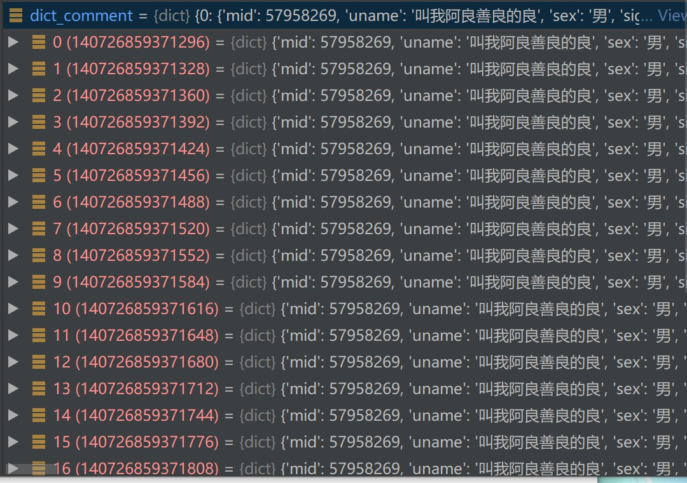
		


- 将保存的数据存储到json文件中
	```python
	def save_commment_to_json(datadf, data_name, path='./data/'):
		'''
		将数据datadf转为json文件后以data_name名称存储到path路径下

		:param datadf: 存储的文件（DataFrame）
		:param data_name:  数据名      ex: quanzhi_comment
		:param path: 文件存储的路径    ex : ./data/
		:return:
		'''
		# path = ./data/total_comment.json
		try:
			path = path+data_name+'.json'
			datadf_json = datadf.to_json(orient='index', force_ascii=False)
			with open(path, "w", encoding="utf-8") as file_data:
				file_data.write(datadf_json)
			return True
		except:
			traceback.print_exc()
			return False
	```


- 代码运行及保存的数据（部分）  

  - 保存的数据
	```json
	{
		"0": {
			"ctime": "2019-09-02 10:08:24",
			"current_level": 5,
			"like": 0,
			"message": "剧透真的没素质",
			"mid": 6575215,
			"rcount": 0,
			"sex": "男",
			"sign": "他居然说我太懒。。",
			"uname": "归于寂静",
			"vipDueDate": 1655395200000,
			"vipType": 2
		},
		"1": {
			"ctime": "2019-09-01 20:19:41",
			"current_level": 2,
			"like": 0,
			"message": "md,没有粤语那",
			"mid": 55946176,
			"rcount": 0,
			"sex": "保密",
			"sign": "",
			"uname": "白嫖王子233",
			"vipDueDate": 0,
			"vipType": 0
		},
	```


### 线程类：`class SpiderThread(QThread)`
__为了将程序运行时的各种信息发送到GUI中，因此将原本面向过程的代码修改为面向对象，并继承了QThread的方法。__  
- 完整代码实现  
[GUI.py](./main_code/GUI.py)  
[spider_bilibili_comment.py](./main_code/spider_bilibili_comment.py)  
看懂此部分代码需要了解pyqt
- 以下几部分代码与上面功能相同，只是实现细节有小部分变换，不再赘述，
	- 获取网页内容

		- `def get_av_info(self)`

	- 提取关键信息

		- `def get_comment_info(self, oid, pn)`

	- 输出保存

		- `def save_comment_to_json(self, datadf, data_name, img, data_path='./data/')`
- QThread  
	使用了pyqt的信号
	```python
	finished_signal = pyqtSignal()
    log_signal = pyqtSignal(str)
    result_signal = pyqtSignal(dict)
    progressbar_signal = pyqtSignal(int, int)
    error_signal = pyqtSignal(int)
	```
	使用上面定义的这些变量来传递相关的信息给GUI界面中日志栏或者调用GUI.py中的函数。

---

## 数据分析  
[data_analysis.py](./main_code/data_analysis.py)
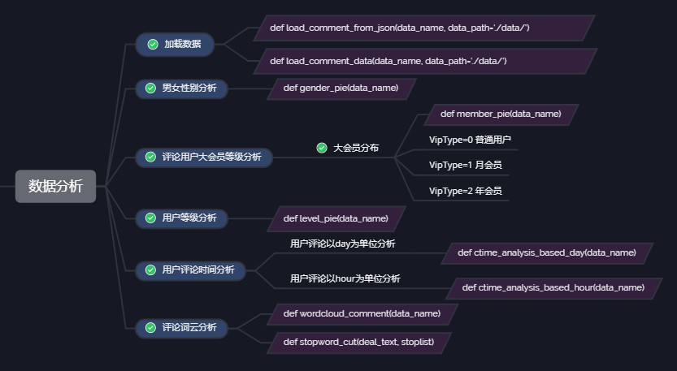
- 总体思路：  
先将保存的数据从文件中加载到内存中，然后使用matplotlib库的各种函数来生成相应的图像。  
其中词云分析库需要自行下载学习使用，部分参考资料。  
[jieba分词库](./https://blog.csdn.net/u012052268/article/details/77825981)  
[词云分析库相关参数](./https://blog.csdn.net/qq_27056805/article/details/88656974)
- 效果图
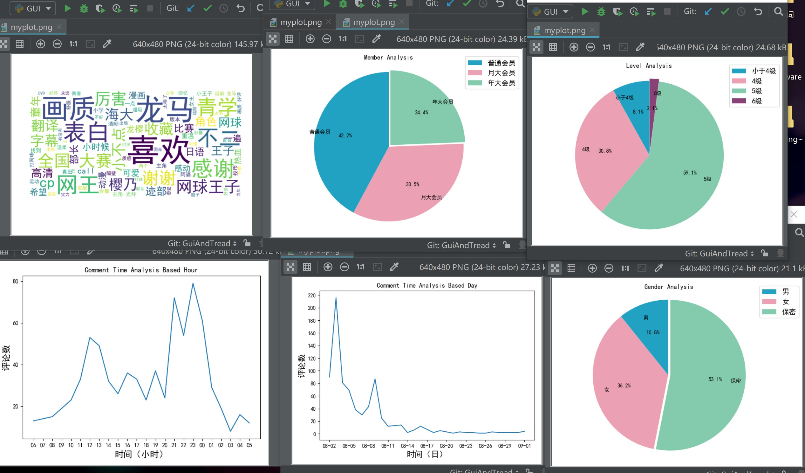    
(有没有觉得配色很丑emmm)


### 相关函数实现
- 加载数据
	```python
	def load_comment_from_json(data_name, data_path='./data/'):
    """
    加载json评论数据，并且以DataFrame的数据结构返回
    :param data_path:
    :param data_name:
    :return:
    """
    try:
        # 获取用户+评论数据
        user_data_path = data_path + data_name + '.json'
        datadf = pd.read_json(user_data_path, orient='index', encoding='utf-8')
    except:
        # traceback.print_exc()
        print('加载用户评论数据失败')
        return 0
    data_path = './data_analysis/' + data_name + '/'
    if not path.exists(data_path):
        os.makedirs(data_path)
    return datadf
	```
	```python
	def load_comment_data(data_name, data_path='./data/'):
    try:
        # 获取评论数据
        comment_data_path = data_path + 'comment_data/' + data_name + '.txt'
        with open(comment_data_path, 'r', encoding='utf-8') as f:
            text = f.read()
    except:
        print('加载评论数据失败')
        return 0, 0
    return text
	```
- 男女性别分析
	```python
	def gender_pie(data_name):
    '''
    输出男女性别的饼图
    :param data_name:
    :return:
    '''
    global datadf, text
    try:
        data_dict = {'男': 0, '女': 0, '保密': 0}
        for i in datadf['sex'].values:
            data_dict[i] += 1
        explode = (0, 0, 0.03)
        plt.pie(data_dict.values(), explode=explode, labels=tuple(data_dict.keys()),
                autopct='%.1f%%', labeldistance=0.8, startangle=90,
                colors=('#22a2c3', '#eba0b3', '#83cbac'))
        # labeldistance，文本的位置离远点有多远，1.1指1.1倍半径的位置
        # autopct，圆里面的文本格式，%3.1f%%表示小数有三位，整数有一位的浮点数
        # shadow，饼是否有阴影
        # startangle，起始角度，0，表示从0开始逆时针转，为第一块。一般选择从90度开始比较好看
        # pctdistance，百分比的text离圆心的距离
        # patches, l_texts, p_texts，为了得到饼图的返回值，p_texts饼图内部文本的，l_texts饼图外label的文本

        # 改变文本的大小
        # 方法是把每一个text遍历。调用set_size方法设置它的属性

        plt.axis('equal')  # 让图像保持圆形

        plt.legend(loc="upper right", fontsize=13, bbox_to_anchor=(1.1, 1.05), borderaxespad=0.3)
        # loc =  'upper right' 位于右上角
        # bbox_to_anchor=[0.5, 0.5] # 外边距 上边 右边
        # ncol=2 分两列
        # borderaxespad = 0.3图例的内边距

        plt.title('Gender Analysis')
        save_path = "./data_analysis/" + data_name + "/Gender_pie_" + data_name + ".jpg"
        plt.savefig(save_path, dpi=600)
        plt.show()
        print('性别分析饼图已保存：./data_analysis/' + data_name + '/Gender_pie_' + data_name + '.jpg')
    except:
        traceback.print_exc()
	```
	
- 评论用户大会员等级分析
	```python
	def member_pie(data_name):
    """
        输出会员构成的饼图
		vipType=0 普通用户
		vipType=1 月会员
		vipType=2 年会员
        :param data_name:
        :return:
    """
    global datadf, text
    try:
        data_dict = {'普通会员': 0, '月大会员': 0, '年大会员': 0}
        for i in datadf['vipType']:
            if i == 0:
                data_dict['普通会员'] += 1
            elif i == 1:
                data_dict['月大会员'] += 1
            elif i == 2:
                data_dict['年大会员'] += 1

        explode = (0, 0, 0.03)
        plt.pie(data_dict.values(), explode=explode, labels=tuple(data_dict.keys()),
                autopct='%.1f%%', labeldistance=0.8, startangle=90,
                colors=('#22a2c3', '#eba0b3', '#83cbac'))  # TODO 颜色
        plt.axis('equal')  # 让图像保持圆形
        plt.legend(loc="upper right", fontsize=13, bbox_to_anchor=(1.1, 1.05), borderaxespad=0.3)
        plt.title('Member Analysis')
        save_path = "./data_analysis/" + data_name + "/Member_pie_" + data_name + ".jpg"
        plt.savefig(save_path, dpi=600)
        plt.show()
        print('会员分析饼图已保存：./data_analysis/' + data_name + '/Member_pie_' + data_name + '.jpg')
    except:
        traceback.print_exc()
	```
	- 问题
	1. plt的图像汉字是方框  
		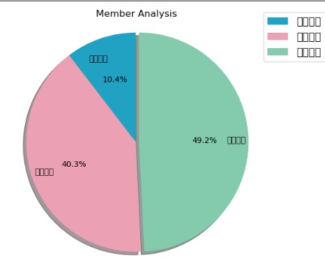
		解决方法：自行设置字体

		```python
		plt.rcParams['font.sans-serif'] = ['SimHei']  # 用来正常显示中文标签
		plt.rcParams['axes.unicode_minus'] = False  # 用来正常显示负号
		```
- 用户等级分析

	```python
	def level_pie(data_name):
    """
        输出用户等级的饼图
        :param data_name:
        :return:
    """
    global datadf, text
    try:
        data_dict = {'小于4级': 0, '4级': 0, '5级': 0, '6级': 0}
        for i in datadf['current_level']:
            if i < 4:
                data_dict['小于4级'] += 1
            elif i == 4:
                data_dict['4级'] += 1
            elif i == 5:
                data_dict['5级'] += 1
            elif i == 6:
                data_dict['6级'] += 1

        explode = (0, 0, 0, 0.03)
        plt.pie(data_dict.values(), explode=explode, labels=tuple(data_dict.keys()),
                autopct='%.1f%%', labeldistance=0.8, startangle=90,
                colors=('#22a2c3', '#eba0b3', '#83cbac', '#894276'))  # 颜色
        plt.axis('equal')  # 让图像保持圆形
        plt.legend(loc="upper right", fontsize=13, bbox_to_anchor=(1.1, 1.05), borderaxespad=0.3)
        plt.title('Level Analysis')
        save_path = "./data_analysis/" + data_name + "/level_pie_" + data_name + ".jpg"
        plt.savefig(save_path, dpi=600)
        plt.show()
    except:
        traceback.print_exc()
	```

- 用户评论时间分析

	- 用户评论以day为单位分析
		```python
		def ctime_analysis_based_day(data_name):
		'''
		输出以日为单位的评论数的折线图
		:param data_name:
		:return:
		'''
		global datadf, text
		try:
			data_dict = {}
			for i in datadf['ctime'].values:
				k = i[5:]
				if k in data_dict.keys():
					data_dict[k] += 1
				else:
					data_dict[k] = 1
			ax = plt.subplot(111)

			# li_x = []
			# li_y = []
			# # TODO 这里是按照内存地址排序的，而内存地址的顺序不是日期的顺序，需要写一个按照日期顺序排序的函数
			# for i in data_dict:
			#     li_x.append(i)
			#     li_y.append(data_dict[i])
			# li_x = li_x[::-1]
			# li_y = li_x[::-1]

			# 这个方法和上面方法一样的效果
			li_x = list(data_dict.keys())[::-1]
			li_y = list(data_dict.values())[::-1]

			ax.plot(li_x, li_y)

			# TODO 修改曲线的颜色类型
			# 通过这四句话来控制 x，y轴的密度  ticker.MultipleLocater()给出的数字明确控制刻度线间距，允许自动限制确
			length = len(data_dict)

			# 设置 x 密度
			xtick_spacing = int(length / 13) + 1
			ax.xaxis.set_major_locator(ticker.MultipleLocator(xtick_spacing))
			ytick_spacing = int(round(max(data_dict.values()) / 150) * 10) + 10
			if ytick_spacing < 11:
				ytick_spacing = 1
			ax.yaxis.set_major_locator(ticker.MultipleLocator(ytick_spacing))

			ax.set_title("Comment Time Analysis Based Day")
			plt.xlabel('时间（日）', fontproperties='SimHei', fontsize=15)
			plt.ylabel('评论数', fontproperties='SimHei', fontsize=15)

			save_path = "./data_analysis/" + data_name + "/CTime(day)_line_chart_" + data_name + ".jpg"
			plt.savefig(save_path, dpi=600)

			plt.show()
			print('评论时间(day)分析折线图已保存：./data_analysis/' + data_name + '/CTime(day)_line_chart_' + data_name + '.jpg')
		except:
			traceback.print_exc()
		```

	  - 问题：
	  1. 因为python的字典本身是无序的，所以我将字典转为list时，函数是按照字典内存的顺序从低位到高位转，这时候生成的日期就可能是乱序的，暂时想到的解决方法是写一个函数(还未实现)，将其按照字典的key排序生成一个list。
	  2. 图像的x,y轴密度问题，有的视频它的评论很多，有的视频评论很少，如果我将x,y轴的间距设置为定值，就可能导致纵坐标值过密或者过疏。因此我使用下述方法来根据当天最大评论数来设定间距。  
	  
			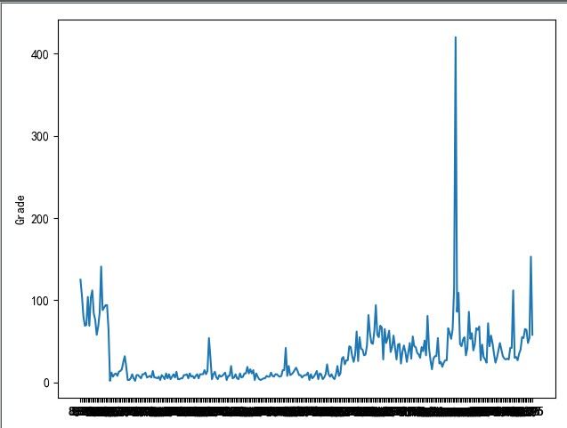  
			```python
			xtick_spacing = int(length / 13) + 1
			ax.xaxis.set_major_locator(ticker.MultipleLocator(xtick_spacing))
			ytick_spacing = int(round(max(data_dict.values()) / 150) * 10) + 10
			if ytick_spacing < 11:
				ytick_spacing = 1
			```

	- 用户评论以hour为单位分析
		```python
		def ctime_analysis_based_hour(data_name):
		'''
		输出以小时为单位的评论数的折线图
		:param data_name:
		:return:
		'''
		global datadf, text
		try:
			data_dict = {'05': 0, '04': 0, '03': 0, '02': 0, '01': 0, '00': 0, '23': 0, '22': 0,
						'21': 0, '20': 0, '19': 0, '18': 0, '17': 0, '16': 0, '15': 0, '14': 0,
						'13': 0, '12': 0, '11': 0, '10': 0, '09': 0, '08': 0, '07': 0, '06': 0}
			for i in datadf['ctime_time'].values:
				k = i.astype(str)[11:13]
				if k in data_dict.keys():
					data_dict[k] += 1
				else:
					data_dict[k] = 1
			ax = plt.subplot(111)
			li_x = list(data_dict.keys())[::-1]
			li_y = list(data_dict.values())[::-1]
			ax.plot(li_x, li_y)
			# TODO 修改曲线的颜色类型
			ax.set_title("Comment Time Analysis Based Hour")
			plt.xlabel('时间（小时）', fontproperties='SimHei', fontsize=15)
			plt.ylabel('评论数', fontproperties='SimHei', fontsize=15)

			ytick_spacing = int(round(max(data_dict.values()) / 150) * 10) + 10
			if ytick_spacing < 11:
				ytick_spacing = 1
			ax.yaxis.set_major_locator(ticker.MultipleLocator(ytick_spacing))
			save_path = "./data_analysis/" + data_name + "/CTime(hour)_line_chart_" + data_name + ".jpg"
			plt.savefig(save_path, dpi=600)
			# save_path = os.getcwd() + save_path[1:]
			# os.startfile(save_path)
			plt.show()
			print('评论时间(hour)分析折线图已保存：./data_analysis/' + data_name + '/CTime(hour)_line_chart_' + data_name + '.jpg')
		except:
			traceback.print_exc()
		```

- 评论词云分析  
	```python
	def stopword_cut(deal_text, stoplist):
    '''
    根据暂停词列表去掉原文本中的暂停词,返回处理后的text
    :param deal_text:
    :param stoplist:
    :return:
    '''
    result = []
    for i in jieba.cut(deal_text):
        if i not in stoplist and len(i) > 1:
            result.append(i)
    return result
	```
	```python
	def wordcloud_comment(data_name):
    '''
    评论数据 词云分析
    :param data_name:
    :return:
    '''
    # 开始词云分析
    global datadf, text
    try:
        dict_path = './wordcloud_dict/worddict.txt'
        stopword_path = './wordcloud_dict/stopwords.txt'

        jieba.load_userdict(dict_path)  # 加载用户自定义字典
        with open(stopword_path, 'r', encoding='utf-8') as f:  # 加载用户自定义的暂停词
            stoptext = f.read()
        stoplist = stoptext.rsplit(sep="\n")
        text = stopword_cut(text, stoplist)  # 根据暂停词来去掉没用的数据
        text = ' '.join(text)  # 将list变为字符串
        word = WordCloud(font_path="C:\\Windows\\Fonts\\simhei.ttf", max_words=200, min_font_size=7, scale=2,
                         background_color='white')
        word.generate(text)
        plt.imshow(word, interpolation='bilinear')
        plt.axis('off')  # 关闭坐标轴
        save_path = "./data_analysis/" + data_name + "/wordcloud_" + data_name + ".jpg"
        plt.savefig(save_path, dpi=600)
        plt.show()
        print("评论词云图已保存：./data_analysis/" + data_name + "/wordcloud_" + data_name + ".jpg")
    except:
        traceback.print_exc()
	```
	

---
## GUI界面
[GUI.py](./main_code/GUI.py)  
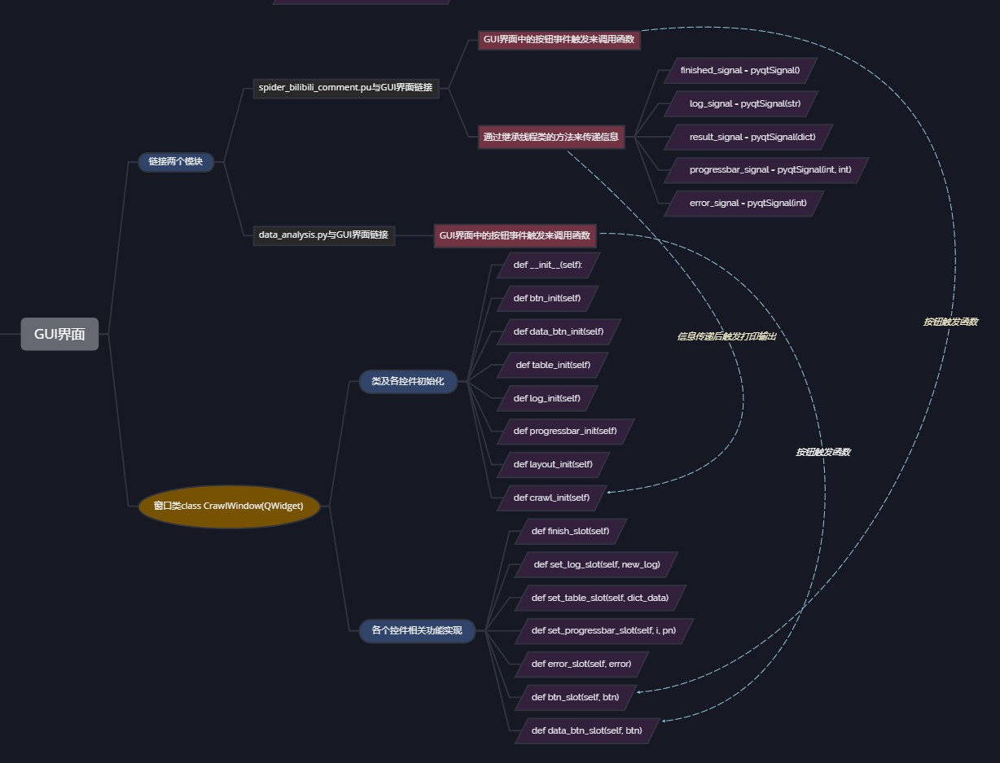

此部分比较基础，只是纯粹的堆砌模块就可以完成，没有太大的问题。
### 链接两个模块

- spider_bilibili_comment.pu与GUI界面链接

	- GUI界面中的按钮事件触发来调用函数
	- 通过继承线程类的方法来传递信息

		- `finished_signal = pyqtSignal()`
		- `log_signal = pyqtSignal(str)`
		- `result_signal = pyqtSignal(dict)`
		- `progressbar_signal = pyqtSignal(int, int)`
		- `error_signal = pyqtSignal(int)`

- data_analysis.py与GUI界面链接

	- GUI界面中的按钮事件触发来调用函数

### 窗口类class CrawIWindow(QWidget)

- 类及各控件初始化

	- `def __init__(self):`
	- `def btn_init(self)`
	- `def data_btn_init(self)`
	- `def table_init(self)`
	- `def log_init(self)`
	- `def progressbar_init(self)`
	- `def layout_init(self)`
	- `def crawl_init(self)`

- 各个控件相关功能实现

	- `def finish_slot(self)`
	- `def set_log_slot(self, new_log)`
	- `def set_table_slot(self, dict_data)`
	- `def set_progressbar_slot(self, i, pn)`
	- `def error_slot(self, error)`
	- `def btn_slot(self, btn)`
	- `def data_btn_slot(self, btn)`

--- 
## python打包为.exe文件
### 使用pyinsatller工具命令打包
[参考资料](https://baijiahao.baidu.com/s?id=1606400855559470971&wfr=spider&for=pc)
- 问题  
  1. 打包后运行显示缺少模块。  
  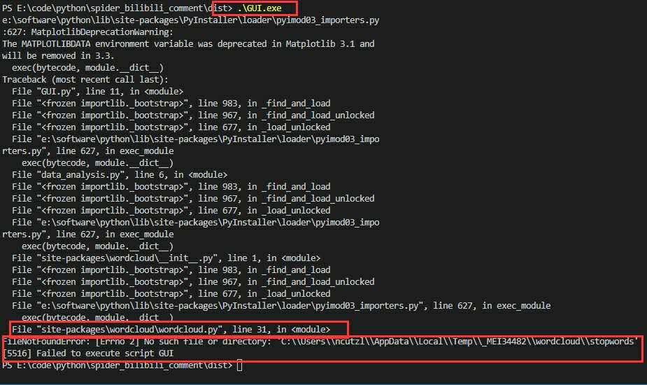  
  决定去它显示的py文件中去修改代码  
  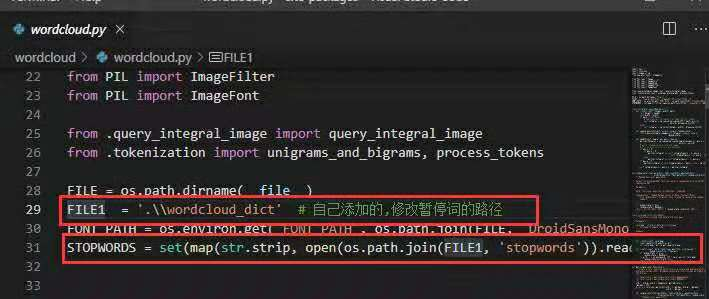  
  重新打包，运行成功。  
  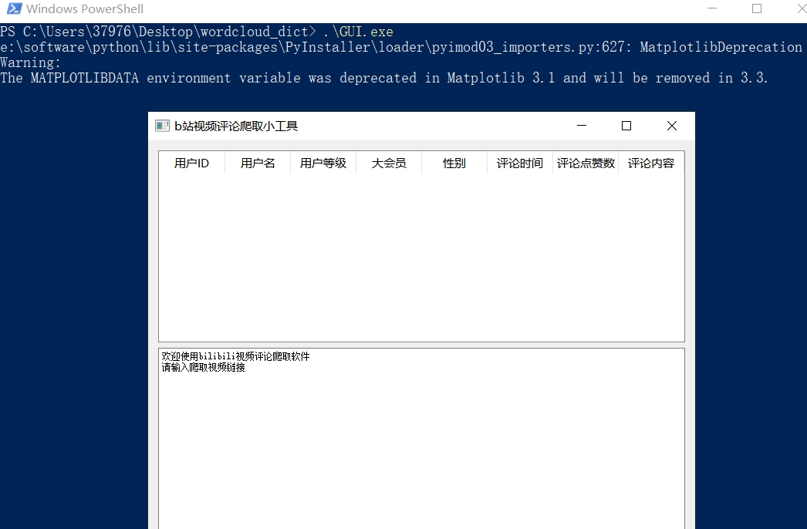
---
## 思考与总结
1. 通过本次项目，我在短短四周的时间里，从对python一头雾水，到现在可以独立做出一个简单的爬虫+数据分析的工具，并实现了打包为.exe文件，并分享给朋友使用。这个过程中尽管遇到了很多挫折，困难，但是都被我一一克服，收获许多。
2. 在本次项目中，我对python的理解不单单只是python本身的语法及本身的特性，更加感受到了python外带库的强大，以及python作为一种解释性语言的优点。
3. 在本次项目中，我使用了许多工具来帮助自己完成它。例如git与github，以前的自己仅仅将其当作一个可以存放代码的仓库，仅仅只用到了最基础的几个命令：add,commit -m '', push,pull,clone等。而通过本次项目，我对于git的分支管理以及版本回溯两个十分强大功能有了深刻的理解。
4. 以前自己无论是用c,c++,java,python等语言写的程序都是只能在终端中运行，并且运行之前还需要配置好相关的环境。本次项目，我不想再停留在终端运行这个程度，更想将自己写的代码做成一个.exe程序，可以分享给朋友来使用。通过使用python的pyinsatller工具命令，实现了我这个小愿望。
5. 代码中还有许多bug和未完工的地方，例如：
   - 对于部分视频名的提取还有问题。
   - 对于错误情况的显示和处理。
   - 日志内容的显示，关键信息不够明确。
   - 对于已保存的爬取信息在关闭软件后，无法重新进行数据分析（尽管之前的结果已保存）。
   - GUI的界面美化。
   - 数据分析的图像美化。
   - 爬取的速度不够快，没有采用多线程。  
   ...

## 参考资料
- 学习资料
	> [python语言程序设计](http://www.icourse163.org/course/BIT-268001)  
	> [python网络爬虫与信息提取](http://www.icourse163.org/course/BIT-1001870001)  
	> [python数据分析与展示](http://www.icourse163.org/course/BIT-1001870002)  
	> [用python玩转数据](http://www.icourse163.org/course/NJU-1001571005)  
    > [wxPython tutorial](http://zetcode.com/wxpython/)  
	> [SciPy](https://scipy.org/)
- 参考博客
	> [Python 网络爬虫实战：爬取 B站《全职高手》20万条评论数据](https://blog.csdn.net/wenxuhonghe/article/details/83791412)  
	> [利用Python爬取B站千万级数据，并对其进行简单的分析](https://www.jianshu.com/p/db1e06eca3b7)  
	> [【python】pandas read_json读取json格式文件,dataframe中list的处理方法](https://www.jianshu.com/p/ad4826bec8e5)  
	> [python中时间、日期、时间戳的转换](https://www.cnblogs.com/jfl-xx/p/8024596.html)  
	> [json与dataframe的转换](https://blog.csdn.net/qq_41780234/article/details/84990551)  
	> [小白学爬虫（四）-- 数据提取之json](https://blog.csdn.net/williamgavin/article/details/81412611)  
	> [matplotlib画图时候x轴的标签过于密集的解决方法](https://blog.csdn.net/funnyPython/article/details/83925573)  
	> [python结巴分词、jieba加载停用词表](https://blog.csdn.net/u012052268/article/details/77825981)  
	> [词云-WordCloud参数详解](https://blog.csdn.net/qq_27056805/article/details/88656974)
	> [用PyQt5开发可视化爬虫软件](https://study.163.com/course/courseMain.htm?courseId=1209157821&share=1&shareId=1143782285)  
	> [Git教程之如何版本回退](https://www.jianshu.com/p/0d4e62dcc62c)  
